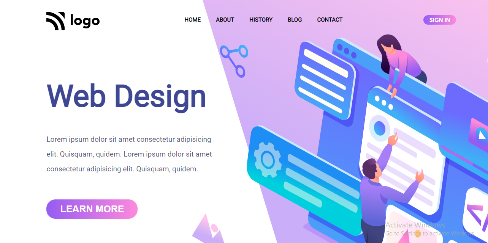

# Mukul Basu

## Project

## Important Things learnt 
1. z-index
2. linear gradient

## Honest Time to finish this project

Took around **3 hrs**
the fun part was to get to play with the linear gradient colors.

## Focus Learning
- linear gradient
- Z-index

## Live link

[Project Link](https://google.com "Netlify")

